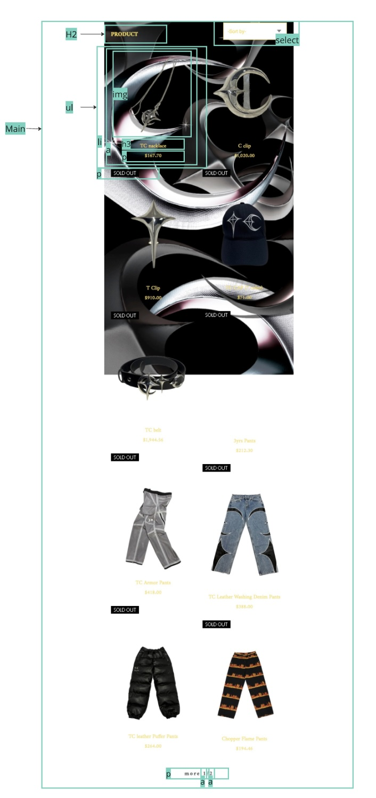
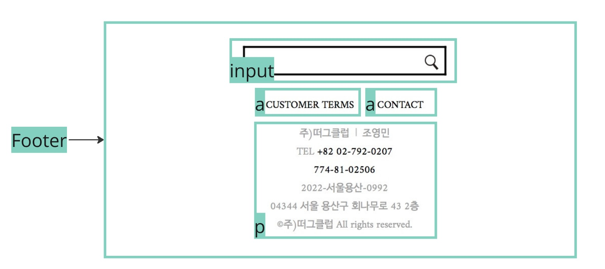

# Procesverslag
Markdown is een simpele manier om HTML te schrijven.  
Markdown cheat cheet: [Hulp bij het schrijven van Markdown](https://github.com/adam-p/markdown-here/wiki/Markdown-Cheatsheet).

Nb. De standaardstructuur en de spartaanse opmaak van de README.md zijn helemaal prima. Het gaat om de inhoud van je procesverslag. Besteedt de tijd voor pracht en praal aan je website.

Nb. Door *open* toe te voegen aan een *details* element kun je deze standaard open zetten. Fijn om dat steeds voor de relevante stuk(ken) te doen.

## Jij

  
uitwerken voor kick-off werkgroep

  ### Auteur:
Jessica Xie

  #### Je startniveau:
Blauw

  #### Je focus:
Responsive
 

## Je website

  
uitwerken voor kick-off werkgroep

  ### Je opdracht:
  https://en.thug-club.com/#anchor1 

  #### Screenshot(s) van de eerste pagina (small screen): 
  homepagina 
  

  #### Screenshot(s) van de tweede pagina (small screen):
  shopping pagina
  
 

## Toegankelijkheidstest 1/2 (week 1)

  
uitwerken na test in 2e werkgroep

  ### Bevindingen
  - screenreader was prima maar nogwel visueel vaag. 
  - amper alt attributen bij afbeeldingen
  - amper titels op pagina
  - tabknop op sommige pagina's niet bruikbaar
  - gebruikt verschillende headings (h1)
  - geen skip link

  

## Breakdownschets (week 1)

  
uitwerken na afloop 3e werkgroep

  ### de hele pagina: 
  

  ### section main: 
  

  ### footer: 
  

## Voortgang 1 (week 2)

  
uitwerken voor 1e voortgang

  ### Stand van zaken
  
  

  ### Agenda voor meeting
  samen met je groepje opstellen

  | Jessica        | student 2          | student 3    | student 4        |
  | ---            | ---                | ---          | ---              |
  | dit bespreken  | en dit             | en ik dit    | en dan ik dat    |
  | en dat ook nog | dit als er tijd is | nog een punt | dit wil ik zeker |
  | ...            | ...                | ...          | ...              |

  ### Verslag van meeting
  - language in de head van nl naar en (engelse site)
  - SVG gebruiken
  - let op indenting
  - alt "item 1" etc heb je niks aan, screenreader leest de titel toch al op
  - voor de footer kijken naar input field
  - adres in de footer in een list zetten ipv paragraaf
  - voor drop-down menu een select element gebruiken
  - homepagina scroll indicator bekijken op internet

## Voortgang 2 (week 3)

  
uitwerken voor 2e voortgang

  ### Stand van zaken
  Het meenemen van de opdrachten in de les en de feedback van de studentassistenten heb ik proberen toe te voegen aan mijn eigen code. Tot nu toe heel erg de originele site zo precies mogelijk na te maken.

  ### Agenda voor meeting
  samen met je groepje opstellen

  | student 1      | student 2          | student 3    | student 4        |
  | ---            | ---                | ---          | ---              |
  | dit bespreken  | en dit             | en ik dit    | en dan ik dat    |
  | en dat ook nog | dit als er tijd is | nog een punt | dit wil ik zeker |
  | ...            | ...                | ...          | ...              |

  ### Verslag van meeting
  - de header in de juiste display zetten
  - button css verbeteren
  - css toevoegen / verbeteren
  - javascript hamburger menu

## Toegankelijkheidstest 2/2 (week 4)

  
uitwerken na test in 9e werkgroep

  ### Bevindingen
Via A11Y had ik gecheckt of de kleurencontrast goed was of niet.

en langzamerhand een light-mode toegevoegd. Mijn site was vanaf het begin al op darkmode gebaseerd.

Vervolgens mijn :focus states verbeterd en controls verbeterd. Mijn tabs doen wel raar. Hier moet ik nog achterna. Mijn headings. li elementen en links kloppen. 

## Voortgang 3 (week 4)

  
uitwerken voor 3e voortgang

  ### Stand van zaken
hier heb ik vooral moeite met javascript en de select = input forms. 

  ### Agenda voor meeting
  samen met je groepje opstellen

  | student 1      | student 2          | student 3    | student 4        |
  | ---            | ---                | ---          | ---              |
  | dit bespreken  | en dit             | en ik dit    | en dan ik dat    |
  | en dat ook nog | dit als er tijd is | nog een punt | dit wil ik zeker |
  | ...            | ...                | ...          | ...              |

  ### Verslag van meeting
  - javascript verbeteren, je moet een micro-interactie hebben
  - sluit button maken, maak het makkelijker voor jezelf
  - form element in je input element toevoegen
  - svg link in je form toevoegen

## Eindgesprek (week 5)

  
uitwerken voor eindgesprek

  ### Je uitkomst - karakteristiek screenshots:
  
  
  

  De site is volledig responsive
  
  
  
  

  Met een light-mode
  
  

  ### Dit ging goed/Heb ik geleerd: 
Ik heb zonder dat het echt hoefde de font-family op de manier fan @font-face in CSS gezet, met :root custom properties gemaakt. Ik heb met javascript kleine animaties (hamburger menu's gecodeerd) en kleine trucjes van javascript weer opgepikt. Ik heb de logica van display grid goed vernomen en begrepen, hoe kolommen en rijen werken in zo'n display grid. Ik heb verder mijn kennis ontwikkeld met display flex. Ik heb voor het eerst een dark-mode light-mode en :focus pseudo-classes gebruikt voor betere accessibility op een site en vooral zitten spelen met parent-child elementen, omdat we niet met < div's> en classes/id's mochten coderen. Om bepaalde codes aan te spreken in CSS en/of javascript was dit wel makkelijker te begrijpen. 

  ### Dit was lastig/Is niet gelukt:
Voor op de homepage moest ik een animerende scrollpagina maken met als gedachtegang dat ik met @keyframes de scroll indicator kon coderen. Dit was mij uiteindelijk niet gelukt.

  

hier zie je aan de rechterkant een kleine gele scroll-indicator die geen toegevoegde waarde geeft. Daarnaast scrollt de pagina niet transformerend naar de andere foto naar mijn wens :c

## Bronnenlijst

  
continu bijhouden terwijl je werkt

  1. MDN input + select
  2. SVGrepo (menu icon)
  3. Codepen (hamburger menu)
  4. Thug Club
  5. OpenAI ChatGPT 

